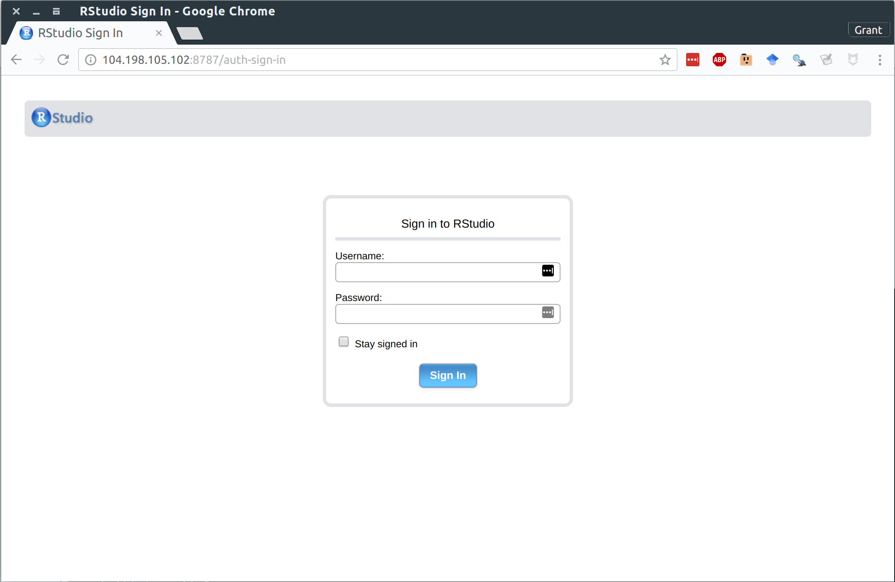
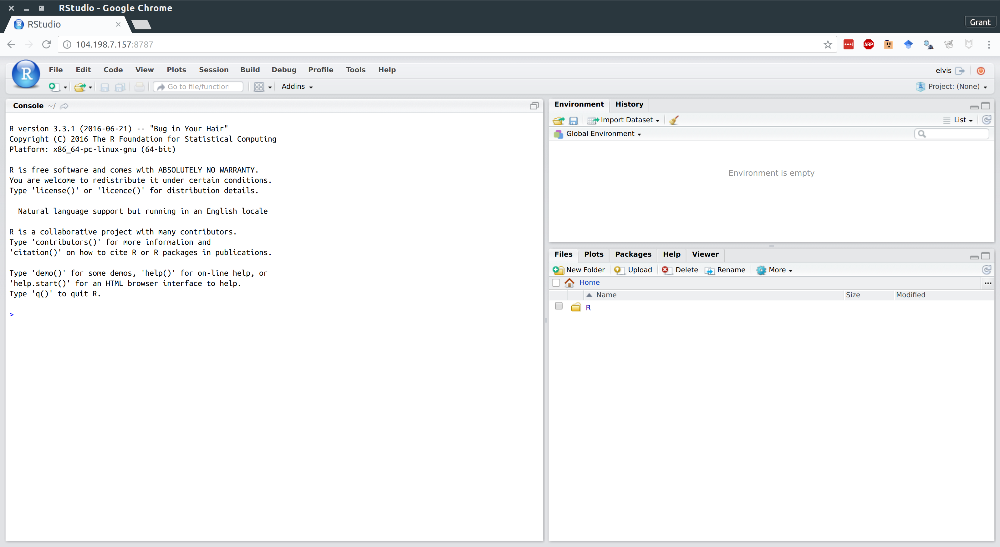

# RStudio Server on Google Compute Engine

This is a how-to guide for setting up a server or virtual machine (VM) with [Google Compute Engine](https://cloud.google.com/compute/). In addition, I'll also show you how to install [RStudio Server](https://www.rstudio.com/products/rstudio/download-server/) on your VM, so that you can perform your analysis in almost exactly the same user environment as you're used to, but now using the full power of cloud-based computation. Trust me, it will be awesome.

## Prerequisites (read carefully)

1. Sign up for a [60-day free trial](https://console.cloud.google.com/freetrial) with the Google Cloud Platform. This requires an existing Google/Gmail acount, although UCSB employees can just use their university email address, since that is run through Gmail. During the course of sign-up, you should [create a project](https://cloud.google.com/resource-manager/docs/creating-managing-projects) that will be associated with billing. While this is purely ceremonial at present -- we're using the free trial period after all -- a billable project ID is required before gaining access to the platform.
2. Download and follow the installation instructions for the Google Cloud SDK command line utility, `gcloud` [here](https://cloud.google.com/sdk/).

> **Tip:** Please take proper note of the Google/Gmail account that you are using when signing up for the Google Cloud Platform in Step 1. (E.g. You might have two accounts, where one is your personal Gmail and the other is linked to your UCSB profile.) Needless to say, you'll want to make sure that you are consistent when setting up the gloud utility in Step 2. Failing to use the same Google account across these steps will simply lead to a bunch of puzzling authentication errors.

## Introduction

First things first: What is a [virtual machine (VM)](https://en.wikipedia.org/wiki/Virtual_machine) and why do I need one anyway? In the simplest sense, a VM is just an emulation of a computer running inside another (bigger) computer. It can potentially perform all or more of the operations that your physical laptop/desktop does, and it might have many of the same properties (from operating system to internal architecture.) The key advantage of a VM from our perspective is that very powerful machines can be "spun up" in the cloud almost effortlessly and then deployed to tackle jobs that are beyond the capabilities of your local computer. Got a big dataset that requires too much memory to analyse on your old laptop? Load it into a high-powered VM. Got some code that takes an age to run? Fire up a VM and let it chug away without consuming any local resources. Or, better yet, write the code in parallel and then spin up a VM with lots of cores (CPUs) to get the analysis done in a fraction of the time. All you need is a working internet connection and a web browser.

Now, with that bit of background in mind, Google Compute Engine is part of the [Google Cloud Platform](https://cloud.google.com/) and delivers high-performance, rapidly scalable VMs. A new VM can be deployed or shut down within seconds, while existing VMs can easily be ramped up or down (cores added, RAM added, etc.) depending on a project's needs. In my experience, Google Compute Engine is at least as good as [Amazon's AWS](https://aws.amazon.com/) -- say nothing of the [other really cool products](https://cloud.google.com/products/) within the Cloud Platform suite -- and most individual users would be really hard-pressed to spent more than a couple of dollars a month using it. (If that.) This is especially true for the researcher who only needs to crunch a particularly large dataset or run some intensive simulations on occasion, and can easily switch the machine off when it's not being used.

> **Tip:** While I very much stand by the above paragraph, it is ultimately *your* responsibility to keep track of your billing and utilisation rates. Take a look at [Google's Could Platform Pricing Calculator](https://cloud.google.com/products/calculator/) to see how much you can expect to be charged for a particular machine and level of usage. You can even [set a budget and create usage alerts](https://support.google.com/cloud/answer/6293540?hl=en) if you want to be extra cautious.

Two final housekeeping notes, before continuing.

First, it's possible to complete nearly all of the steps in this guide via the [Compute Engine browser console](https://console.cloud.google.com/compute/instances). However, we'll stick with the `gcloud` command line utility (which you should have [installed](https://cloud.google.com/sdk/) already), because that will make it easier to [document our steps](http://remi-daigle.github.io/shell/) and will also save us some headaches further down the road. For example, when it comes to transferring files between your local computer and a Compute Engine instance *en masse*.

Second, almost all VMs run on some variant of Linux. Since we'll only be connecting to our VM instance via the terminal, this only matters insofar as some of the commands might invoke slightly different syntax to what you'd normally use on a Mac or Windows PC. If you're brand new to Linux, then I'd recommend taking a quick look at [this website](https://linuxjourney.com/). It provides a great step-by-step overview of some of the key concepts and commands. One thing that I'll briefly mention here is that Ubuntu -- the Linux distribution that we'll be using below -- uses the `apt` package-management system. (Much like Mac OS uses Homebrew.) So when you see commands like `apt-get install PACKAGENAME`, that's just a convenient way to install and manage packages.

Okay, introduction out of the way. Let's get up a running.

## Setup and log-in

You'll need to choose an operating system for your VM, as well as the server zone (region). To see the available options, first open up the terminal ([Windows](http://www.digitalcitizen.life/7-ways-launch-command-prompt-windows-7-windows-8), [Mac](https://www.techwalla.com/articles/how-to-open-terminal-on-a-macbook), [Linux](http://www.wikihow.com/Open-a-Terminal-Window-in-Ubuntu)). Then enter
```
~$ sudo gcloud compute images list
~$ sudo gcloud compute zones list
```
> **Tip:** If you get an error message running the above commands, try re-running them without the "sudo" bit at the beginning. This stands for "[superuser do](https://en.wikipedia.org/wiki/Sudo)", which invokes special user privileges as a security check, but may be redundant on your system. Clearly, if this applies to you, then you will need to do the same for any other commands invoking "sudo" for the rest of this tutorial.

We'll go with Ubuntu 16.04 and set our zone to the U.S. west coast.

> **Tip:** You can set the default zone in your local client so that you don't need to specify it every time. See [here](https://cloud.google.com/compute/docs/gcloud-compute/#set_default_zone_and_region_in_your_local_client).

You can also choose a bunch of other options by using the appropriate flags -- see [here](https://cloud.google.com/sdk/gcloud/reference/compute/instances/create). I'm going to call my VM instance "rstudio" but you can obviously call it whatever you like. I'm also going to specify the type of machine that I want. In this case, I'll go with the `n1-standard-8` option (8 CPUs with 30GB RAM), but you can choose from a [range](https://cloud.google.com/compute/pricing) of machine/memory/pricing options. (Assuming a monthly usage rate of 20 hours, this VM will only [cost about[(https://cloud.google.com/products/calculator/#id=efc1f1b1-175d-4860-ad99-9006ea39651b)] $7.60 a month to maintain once our 60-day free trial ends. I should add further that is very easy to change the specs of your VM and Google will even suggest cheaper alternatives if it thinks that you aren't using your resource capabilities efficiently over time.) In the terminal window, type:
```
~$ sudo gcloud compute instances create rstudio --image-family ubuntu-1604-lts --image-project ubuntu-os-cloud  --machine-type n1-standard-8 --zone us-west1-a
```

This should generate something like:
```
Created [https://www.googleapis.com/compute/v1/projects/YOUR-PROJECT/zones/us-west1-a/instances/rstudio].
NAME      ZONE        MACHINE_TYPE  PREEMPTIBLE  INTERNAL_IP  EXTERNAL_IP      STATUS
rstudio  us-west1-a  n1-standard-8               10.138.0.2   104.198.7.157  RUNNING
````

Write down the External IP address, as we'll need it for running RStudio Server later.

> **Tip:** This IP address is ephemeral in the sense that it is only uniquely assigned to your VM while it is running continuously. This shouldn't create any significant problems, but if you prefer a static (i.e. non-ephemeral) IP address that is always going to be associated with a particular VM instance, then this is easily done. See [here](https://cloud.google.com/compute/docs/configure-instance-ip-addresses#assign_new_instance).

On a similar note, RStudio Server will run on port 8787 of the External IP, which we need to enable via the Compute Engine firewall.
```
~$ sudo gcloud compute firewall-rules create allow-rstudio --allow=tcp:8787
```
Congratulations: Set-up for your Compute Engine VM instance is complete! Easy, wasn't it?

Let's start it up and then log in via SSH. This is a simple matter of providing your VM's name and zone (if you forget to specify the zone or haven't assigned a default, you'll be prompted):

```
~$ sudo gcloud compute instances start rstudio --zone us-west1-a
~$ sudo gcloud compute ssh rstudio --zone us-west1-a
```

Upon logging in for the first time, you will be prompted to generate an SSH key passphrase. Needless to say, you should make a note of this for future long-ins. You should now be connected to your VM via terminal, with your command line interface indicating "rstudio" as the relevant hostname. That is, you should see something like the following:

```
root@rstudio:~#
```
> **Tip:** Don't worry if you're logged in under your normal username instead of "root" like I have here. Again, this is just a reflection of your OS security defaults and/or user preferences. However, it does mean that you will probably have to *add* "sudo" to the beginning of the remaining terminal commands while you are connected to your VM. (In other words, reverse the earlier tweak that I suggested in this tutorial!) On that note: Another neat feature of VM's is that your whole team can work on the *same* OS up in the cloud, regardless of local machine types and constraints. In this way, VMs can be used to overcome many of the interoperability hurdles that can plague scientific/programming teamwork.

Next, we'll install *R* before moving on to RStudio Server.

### Install *R* on your VM

You can find the full set of instructions and recommendations for installing *R* on Ubuntu [here](https://cran.r-project.org/bin/linux/ubuntu/README). Or you can just follow my choices below, which covers everything that you should need.
```
root@rstudio:~# sh -c 'echo "deb https://cloud.r-project.org/bin/linux/ubuntu xenial/" >> /etc/apt/sources.list'
root@rstudio:~# apt-key adv --keyserver keyserver.ubuntu.com --recv-keys E084DAB9
root@rstudio:~# apt-get update
root@rstudio:~# apt-get install r-base r-base-dev
```
> **Tip:** Again, if you have trouble running any of the above commands -- particularly if your username isn't "root" -- then you should try to add "sudo" to the beginning of each line. Continue doing this for the remaining commands below as needed.

In addition to the above, a number of important *R* packages require external Linux libraries that must first be installed separately on your VM. For example, the `curl` *R* package, which in turn is a dependency for many other packages. In Ubuntu (or other Debian-based distros), run the below commands in your VM's terminal:

1) For the "tidyverse" suite of packages (i.e. `install.packages("tidyverse")`:
```
root@rstudio:~# apt-get install libcurl4-openssl-dev libssl-dev libxml2-dev
```
2) For the main spatial libraries (sp, rgeos, etc.):
```
root@rstudio:~# apt-get install libgeos-dev libproj-dev libgdal-dev
```

*R* is now ready to go your on VM directly from terminal:
```
root@rstudio:~# R
```
However, we'd obviously prefer to use the awesome IDE interface provided by RStudio (Server). So that's what we'll install and configure next, making sure that we can run RStudio Server on our VM via a web browser like Chrome or Firefox from our local computer. (Hit `q()` and then `n` to exit the terminal version of *R* if you opened it above.)

## Install and configure RStudio Server

### Download RStudio Server on your VM

You should check what the latest available version of Rstudio Server is [here](https://www.rstudio.com/products/rstudio/download-server/), but as of today (11 Jan 2016) the following is what you need:
```
root@rstudio:~# apt-get install gdebi-core
root@rstudio:~# wget https://download2.rstudio.org/rstudio-server-1.0.136-amd64.deb
root@rstudio:~# gdebi rstudio-server-1.0.136-amd64.deb
```

### Add a user

Now that you're logged into your VM, you might notice that you haven't actually signed in as a specific user. In fact, like me you may be automatically signed into the "rstudio" VM as root. (Fun fact: You can tell because the command line has a hashtag instead of a dollar sign.) This doesn't matter for most applications, but RStudio Server specifically requires a username/password combination. So we first need to create a new user before continuing. For example, to create a new user called "elvis" enter the follow command in terminal.
```
root@rstudio:~# adduser elvis
```
You will then be prompted to specify a password for this user (and confirm various bits of biographical information which you can largely ignore).

### Navigate to your RStudio Server instance in your browser

You are now ready to open up RStudio Server by navigating to the default 8787 port of your VM's External IP address. (You remember writing this down earlier, right?) If you forgot to write the IP address down, don't worry: You can find it by logging into your Google Cloud console and looking at your [VM instances](https://console.cloud.google.com/compute/instances), or by opening up a new terminal window (<u>not</u> the one currently connected to your VM) and typing:
```
~$ sudo gcloud compute instances describe rstudio  --zone us-west1-a
```
Either way, once you have the address, open up your preferred web browser and navigate to:
```
http://<external-ip-address>:8787
```
You will be presented with the following web page. Log in using the username/password that you created earlier.



And we're all set. Here is RStudio Server running on my laptop via Google Chrome.

> **Tip:** Hit F11 to go full screen in your browser. The server version of RStudio is then almost indistinguishable from the desktop version.



## Stopping and (re)starting your VM instance
Stopping and (re)starting your VM instance is easy, so you don't have to worry about getting billed for times when you aren't using it. In a new terminal (not the one currently synced to your VM instance):
```
~$ sudo gcloud compute instances stop rstudio
~$ sudo gcloud compute instances start rstudio
```

## Troubleshooting: Getting the most out of your Compute Engine + RStudio Server setup

Once you've completed the installation steps above, your VM will be ready to go with RStudio Server whenever you want it. However, there are several additional things that you can do to really improve the user experience and reduce complications when interacting with your VM from your local computer. Here are my primary tips and recommendations:

### Transferring and syncing files between your VM and your local computer

You have two (three) main options.

#### 1.1 Manually transfer files directly from RStudio Server

This is arguably the simplest option and works well for copying files from your VM to your local computer. However, I can't guarantee that it will work as well going the other way; you may need to adjust some user privileges first.


#### 1.2 Manually transfer files and folders using the command line or SCP

Manually transferring files or folders across systems is done fairly easily using the command line:

```
~$ sudo gcloud compute copy-files rstudio:/home/elvis/Papers/MyAwesomePaper/amazingresults.csv ~/local-directory/amazingresults-copy.csv --zone us-west1-a
```
It's also possible to transfer files using your regular desktop file browser thanks to SCP. (On Linus and Mac OSX at least. Windows users first need to install a program call WinSCP.) See [here](https://cloud.google.com/compute/docs/instances/transfer-files).

> **Tip:** The SCP solution is much more efficient when you have assigned a static IP address to your VM instance -- otherwise you have to set it up each time you restart your VM instance and are assigned a new ephemeral IP address -- so I'd advise doing that [first](https://cloud.google.com/compute/docs/configure-instance-ip-addresses#assign_new_instance).

#### 2. Sync with Git(Hub), Box, Dropbox, or Google Drive

Ubuntu, like all Linux distros, comes with Git preinstalled. You should thus be able to sync your results across systems using Git(Hub) in the [usual fashion](http://happygitwithr.com/). I tend to use the command line for all my Git operations -- committing, pulling, pushing, etc. -- and I also had some teething problems with Rstudio Server's in-built Git UI when I first tried it on a VM. However, I believe that these issues have been mostly resolved so let me know if that works for you.

Similarly, while I haven't tried it myself, you should also be able to install [Box](http://xmodulo.com/how-to-mount-box-com-cloud-storage-on-linux.html), [Dropbox](https://www.linuxbabe.com/cloud-storage/install-dropbox-ubuntu-16-04) or [Google Drive](http://www.techrepublic.com/article/how-to-mount-your-google-drive-on-linux-with-google-drive-ocamlfuse/) on your VM and sync across systems that way. If you go this route, then I'd advise installing these programs as sub-directories of the user's "home" directory. Even then you may run into problems related to user permissions. However, just follow the instructions for linking to the hypothetical "TeamProject" folder that I describe in the next subsection below (except that you must obviously point towards the relevant Box/Dropbox/GDrive folder location instead) and you should be fine.

> **Tip:** Remember that your VM lives on a server and doesn't have the usual graphical interface -- including installation utilities -- of a normal desktop. You'll thus need to follow command line installation instructions for these programs. Make sure you scroll down to the relevant sections of the links that I have provided above.

Last, but not least, Google themselves encourage data synchronisation on Compute Engine VMs using another product within their Cloud Platform, i.e. [Google Storage](https://cloud.google.com/storage/). This is especially useful for really big data files and folders, but beyond the scope of this tutorial. (If you're interested in learning more, see [here](https://cloud.google.com/solutions/filers-on-compute-engine) and [here](https://cloud.google.com/compute/docs/disks/gcs-buckets).)

### Reading and writing files to and from shared directories between multiple users on the same VM

The default configuration above works perfectly well in cases where you are a single user and don't venture outside of your home directory (and its sub directories). Indeed, you can just add new folders within this user's home directory using [standard Linux commands](https://linuxjourney.com/lesson/make-directory-mkdir-command) and you will be able to access these from within RStudio Server when you log in as that user.

However, there's a slight wrinkle in cases where you want to share information between *multiple* users on the same VM. (Which may well be necessary on a big group project.) In particular, RStudio Server is only going to be able to look for files in each individual user's home directory (e.g. `/home/elvis`.) The reason has to do with user permissions; since Elvis is not a "super user", RStudio Server doesn't know that he is allowed to access other user's directories in our VM, and vice versa. Thankfully, there's a fairly easy workaround, involving standard Linux commands for adding [user and group](https://linuxjourney.com/lesson/users-and-groups) [privileges](https://linuxjourney.com/lesson/file-permissions). I won't explain these in depth here, but an example follows below:

Let's say that Elvis is working on a joint project together with a colleague called Priscilla. They have decided to keep all of their shared analysis in a new directory called "TeamProject", hosted on Elvis's home directory. We first need to give Priscilla her own user profile. Then, we create the new shared directory under Elvis's home directory:
```
root@rstudio:~# adduser priscilla
root@rstudio:~# mkdir /home/elvis/TeamProject
```
Next, create a group -- call it "projectgrp" -- whose members should all have full read, write and execute access to files within the Papers directory. Then add both a default user (i.e. Elvis) and other members (i.e. Priscilla) to this group:
```
root@rstudio:~# groupadd projectgrp
root@rstudio:~# gpasswd -a elvis projectgrp
root@rstudio:~# gpasswd -a priscilla projectgrp
```
Next, set our default user (i.e. "elvis") and the other projectgrp members as owners of this directory as well as all of its children directories (`chown -R`). Grant them all read, write and execute access (`chmod -R 770`):
```
root@rstudio:~# chown -R elvis:projectgrp /home/elvis/TeamProject
root@rstudio:~# chmod -R 770 /home/elvis/TeamProject
```

The next two commands are optional, but advised if Priscilla is only going to be working on this VM through the TeamProject directory. First, you can change her primary group ID to projectgrp, so that all the files she creates are automatically assigned to that group:
```
root@rstudio:~# usermod -g projectgrp priscilla
```
Second, you can add a symbolic link to the TeamProject directory in Priscilla's home directory, so that it is immediately visible when she logs into RStudio Server. (Making sure that you switch to her account before running this command):
```
root@rstudio:~# su - priscilla
priscilla@rstudio:~$ ln -s /home/elvis/TeamProject /home/priscilla/TeamProject
priscilla@rstudio:~$ exit
```

### Other tips
Remember to keep your VM system up to date (just like you would a normal computer).
```
root@rstudio:~# gcloud components update
root@rstudio:~# apt-get upgrade
```

## Summary

Assuming that you have gone through the initial set-up, here's the **tl;dr** summary of how to deploy an existing VM with RStudio Server:

1) Start-up a VM instance.
```
~$ sudo gcloud compute instances start YOUR-VM-INSTANCE-NAME
```
2) Take note of the External IP address if you need to (see step 4 below):
```
~$ sudo gcloud compute instances describe YOUR-VM-INSTANCE-NAME
```
3) Log-in via SSH.
```
~$ sudo gcloud compute ssh YOUR-VM-INSTANCE-NAME
```
4) Open up a web browser and navigate to RStudio Server via your VM's External IP address (enter your username/password as needed):
```
http://<external-ip-address>:8787
```
5) Stop your VM:
```
~$ sudo gcloud compute instances stop YOUR-VM-INSTANCE-NAME
```
And, remember, if you really want to avoid the command line, then you can always go through the [Compute Engine browser console](https://console.cloud.google.com/home/dashboard).

## Additional resources

As a final word, just remember to consult the official documentation if you ever get stuck. There's tonnes of useful advice and extra tips for getting the most out of your VM setup, including ways to integrate your system with other products within the Google Cloud platform like BigQuery, Storage, etc. etc.
- Google Compute Engine documentation ([link](https://cloud.google.com/compute/docs/))
- RStudio Server documentation ([link](https://support.rstudio.com/hc/en-us/articles/234653607-Getting-Started-with-RStudio-Server))
- Linux Journey guide ([link](https://linuxjourney.com/))
